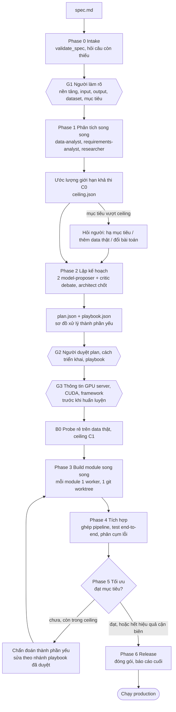
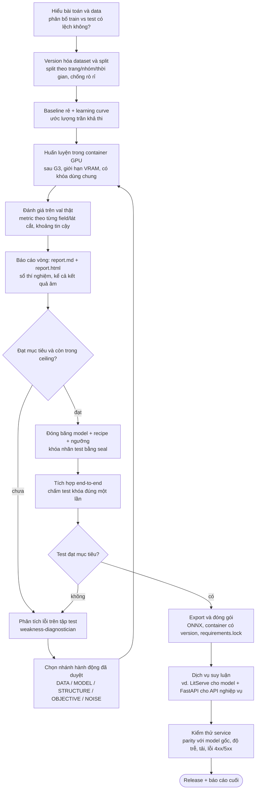
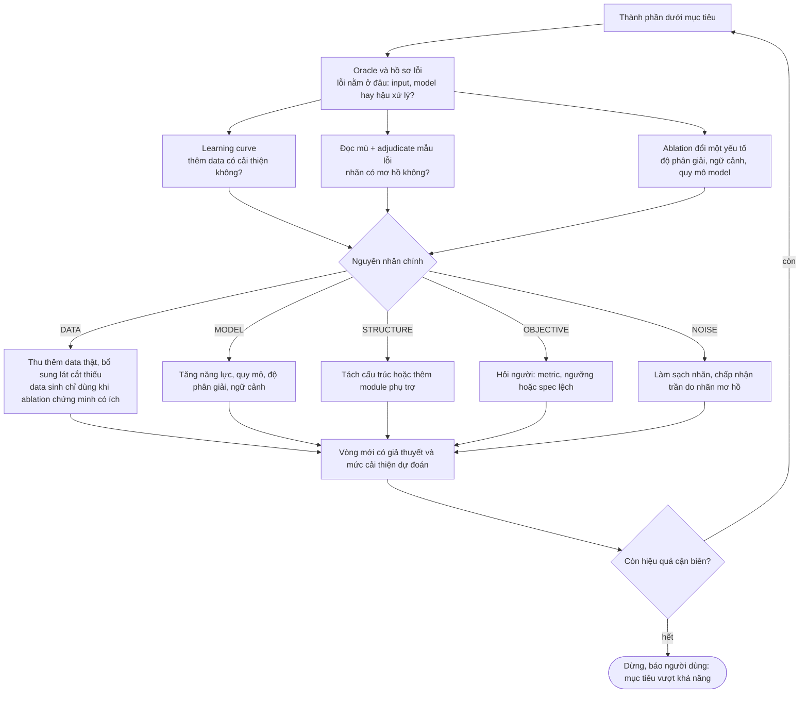
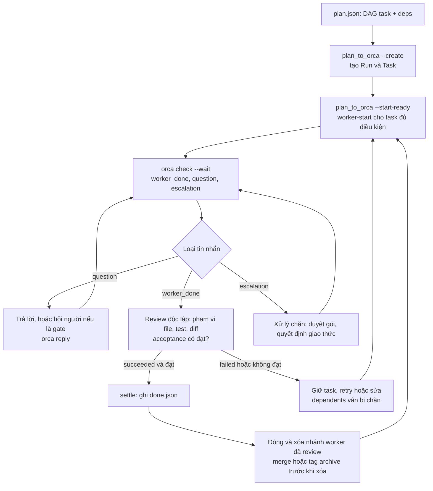
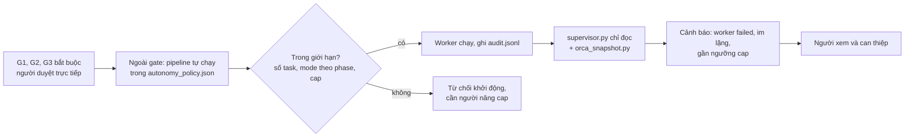
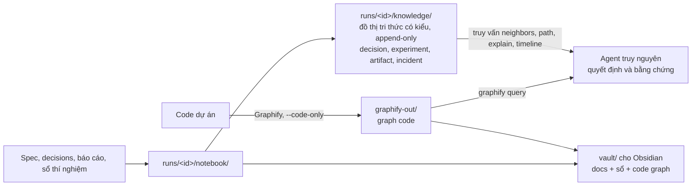

# ai-pipeline

Workflow đa agent cho dự án AI: **file spec → kế hoạch → thực thi song song**, chạy được trên **Claude Code** và **Codex**, điều phối bằng **[Orca](https://github.com/stablyai/orca)**. `ai-pipeline` là CLI cài workflow này vào **bất kỳ project nào** (Linux, macOS, Windows) mà không đụng tới file của bạn.

Nguyên tắc: data trước, không làm phức tạp hoá, ước lượng giới hạn khả thi trước khi tối ưu, mọi thí nghiệm có `report.md` + `report.html`, người duyệt ở 3 cổng G1/G2/G3, mọi việc chạy trong sandbox container.

## Quy trình sản xuất pipeline AI (tổng quan)

Đầu vào là một file spec. Coordinator (Claude Code hoặc Codex) chạy các phase; mỗi phase là một đợt worker song song trên Orca. Ba cổng **G1/G2/G3** luôn cần người duyệt.



Quy tắc xuyên suốt: data trước, mỗi dataset/model gắn version, sau **mỗi vòng thí nghiệm** phải có `report.md` + `report.html` rồi mới sang vòng sau, mọi việc chạy trong sandbox container.

## Phát triển một model AI đến production

Mỗi module AI (ví dụ detector, OCR, phân loại, retrieval) đi qua cùng một vòng đời do skill `ai-pipeline-module-dev` hướng dẫn. Điểm quan trọng: đánh giá trên **data thật có nhãn (≥ 50 mẫu)**, và chỉ chạm tập test khóa một lần ở bước tích hợp.



## Chẩn đoán thành phần yếu (trước khi sửa)

Không sửa theo cảm tính. Khi một thành phần dưới mục tiêu, agent `weakness-diagnostician` chạy thí nghiệm phân biệt nguyên nhân, rồi chọn nhánh hành động trong playbook đã được duyệt ở G2.



Ví dụ thực tế: bài timesheet OCR có mục tiêu 99%/field vượt ceiling; thí nghiệm bác bỏ giả thuyết "sinh data tổng hợp giúp được" và "thêm module tách ô giúp được", nên pipeline dừng vòng lặp thay vì chạy mãi.

## Cách coordinator điều phối worker với Orca



Mỗi task build chạy trong git worktree riêng; worker không bao giờ sửa chung một checkout. Agent nào khả dụng do `scripts/agent_roster.py` kiểm tra, người dùng chọn orchestrator và worker trước khi chạy song song.

## Người giám sát (human-on-the-loop)



## Tri thức dự án



### Những gì quy trình chưa tự động hóa

Để không hiểu nhầm mức hoàn thiện: **giám sát sau release (drift, canary, rollback)** mới có chế độ `monitor` trong schema, chưa có công cụ tự động; chưa có CI/CD cho model; experiment tracker/model registry chỉ ở dạng sổ thí nghiệm và đồ thị tri thức; `seal` bảo vệ nhãn test ở mức quy trình, không phải ranh giới bảo mật filesystem.

## Cài đặt

Yêu cầu: Python ≥ 3.9 và git. Không có phụ thuộc Python nào khác.

```bash
# khuyến nghị: pipx (cô lập, có lệnh ai-pipeline toàn cục)
pipx install git+https://github.com/cuongtran2203/ai-pipeline

# hoặc pip
pip install git+https://github.com/cuongtran2203/ai-pipeline

# hoặc không cài, chạy thẳng từ bản clone
git clone https://github.com/cuongtran2203/ai-pipeline && cd ai-pipeline
python -m ai_pipeline --help
```

Để chạy worker song song cần thêm: [Orca](https://github.com/stablyai/orca) và ít nhất một trong `claude` (Claude Code) / `codex`. Docker là tuỳ chọn (sandbox). `ai-pipeline doctor` kiểm tra tất cả.

## Bắt đầu nhanh

```bash
cd my-project            # project có sẵn hoặc thư mục mới
git init                 # nếu chưa là git repo (worker song song dùng git worktree)
ai-pipeline init         # cài workflow
ai-pipeline doctor       # kiểm tra môi trường
cp templates/spec.template.md spec.md   # điền spec (nền tảng, input/output, dataset, mục tiêu)
```

Rồi mở thư mục bằng Claude Code hoặc Codex và nói:

> Chạy ai-pipeline với spec `spec.md`

Agent sẽ chạy skill `ai-pipeline`: validate spec → hỏi bạn ở G1/G2/G3 → tạo Run trên Orca → chạy worker song song. Kết quả nằm ở `runs/<run_id>/`. Hỏi *"dự án đang ở bước nào"* để chạy skill `ai-pipeline-status`.

## `ai-pipeline init` KHÔNG ghi đè hay sửa file của bạn

| Đã có trong project | Hành vi |
|---|---|
| `AGENTS.md`, `CLAUDE.md` | **Không sửa, không xoá.** Luật của workflow nằm ở `.ai-pipeline/AGENTS.md`. Nếu chưa có `AGENTS.md`/`CLAUDE.md` thì tạo file chỉ chứa một dòng trỏ tới đó. Muốn agent đọc luật trong `AGENTS.md` sẵn có: thêm dòng `@.ai-pipeline/AGENTS.md`, hoặc `ai-pipeline init --link` (thêm một khối có marker, gỡ được bằng `uninstall`). Các skill vẫn chạy được độc lập. |
| Skill khác trong `.claude/skills`, `.agents/skills`, `skills/` | **Giữ nguyên.** Chỉ thêm skill `ai-pipeline*` mới. Nếu bạn đã có skill trùng tên, cả thư mục skill đó được bỏ qua (`skip-dir`). |
| File trùng tên trong `scripts/`, `roles/`, `templates/`, `schemas/` | **Bỏ qua** file của bạn (báo `skip`). Dùng `--force` mới ghi đè, và luôn tạo `<file>.bak`. |
| `.gitignore` | Không sửa; chỉ gợi ý dòng cần thêm. `--gitignore` để tự thêm. |

Tính chất: chạy lại `init` nhiều lần cho kết quả giống nhau (idempotent); `--dry-run` chỉ in việc sẽ làm; mọi file đã cài được ghi hash trong `.ai-pipeline.json`.

## Lệnh

| Lệnh | Việc |
|---|---|
| `ai-pipeline init [path] [--agent claude\|codex\|both] [--link] [--gitignore] [--force] [--dry-run] [-v]` | cài workflow vào project |
| `ai-pipeline update [path]` | nâng cấp file framework. File bạn đã sửa được giữ nguyên, bản mới ghi ra `<file>.new` để tự merge |
| `ai-pipeline uninstall [path] [--dry-run]` | gỡ các file đã cài mà bạn chưa sửa; file của bạn và `runs/` không bị đụng |
| `ai-pipeline doctor [path]` | kiểm tra python/git/orca/claude/codex/docker, bản cài, skills mirror |
| `ai-pipeline new-run <tên> <spec.md>` | tạo `runs/<tên>/` từ spec |
| `ai-pipeline status [run_dir]` | phase hiện tại + việc cần làm tiếp |
| `ai-pipeline validate <spec>` | liệt kê câu hỏi còn thiếu cho G1 |
| `ai-pipeline plan plan.json [--dry-run \| --create \| --start-ready]` | DAG → task/worker trên Orca |
| `ai-pipeline report eval.json` | `report.md` (3 phần, tiếng Việt) + `report.html` (gom cụm lỗi) |
| `ai-pipeline pack list\|status\|install\|build\|uninstall [graphify\|obsidian] [--yes]` | cài/build pack tuỳ chọn (xem mục Pack) |
| `ai-pipeline run <script> [args]` | chạy bất kỳ `scripts/<script>.py`; alias: `notebook kg agents diagram cleanup autonomy supervisor seal vault sync-skills` |

Các lệnh `status/validate/plan/...` chỉ gọi script tương ứng trong `scripts/` của project, nên chạy ở thư mục project (hoặc `--path`).

## Pack tuỳ chọn: Graphify và Obsidian

Cài và build qua CLI, **luôn hỏi trước** (`--yes` để đồng ý không hỏi; không có terminal mà thiếu `--yes` thì từ chối, không cài gì):

```bash
ai-pipeline pack status                      # pack nào đã cài / đã build
ai-pipeline pack install graphify            # venv riêng .venv-graphify, graphifyy==0.9.74, lock, .graphifyignore
ai-pipeline pack build graphify              # graph code của cả dự án -> graphify-out/ (--code-only)
ai-pipeline pack install obsidian            # winget / brew --cask / flatpak (hoặc hướng dẫn tải)
ai-pipeline pack build obsidian              # vault/: tài liệu + sổ thí nghiệm + code graph -> mở bằng Obsidian
ai-pipeline init --with graphify,obsidian --yes   # cài cùng lúc với init
ai-pipeline pack uninstall graphify          # xoá venv do CLI tạo
```

- **Graphify**: gói PyPI `graphifyy` (hai chữ y) cài vào venv trong project, không đụng Python hệ thống; cần Python ≥ 3.10 (CLI tự tìm). Build chỉ phân tích code cục bộ (`--code-only`) và gỡ mọi API key LLM khỏi môi trường, nên không có gì rời máy. Không bao giờ chạy `graphify claude|codex install` (lệnh đó sửa `AGENTS.md`/`CLAUDE.md`). `.graphifyignore` có sẵn của bạn được giữ nguyên.
- **Obsidian**: là ứng dụng desktop; CLI chỉ phát hiện/cài bằng trình quản lý gói của hệ điều hành khi bạn đồng ý, rồi dựng `vault/` bằng `scripts/obsidian_vault.py` (stdlib, cục bộ). Thêm `.venv-graphify/`, `graphify-out/`, `vault/` vào `.gitignore`.
- Cần mạng tới pypi.org khi cài Graphify. Mọi pack được ghi vào `.ai-pipeline.json`.

## Thêm skill riêng cho bài toán

Tạo thư mục `skills/<tên-skill>/SKILL.md` rồi `ai-pipeline sync-skills` (chép sang `.claude/skills` và `.agents/skills`; chỉ các skill có trong `skills/` bị thay, skill khác của bạn không bị đụng). `ai-pipeline update` không xoá skill của bạn. Vai trò worker nằm ở `roles/*.md`, template ở `templates/`.

## Những gì được cài

```
.ai-pipeline/AGENTS.md   luật chung của workflow (hoặc đọc qua AGENTS.md của bạn)
skills/                  17 skill: ai-pipeline, -intake, -analysis, -planning, -module-dev, -integration,
                         -report, -orca, -status, -feasibility, -notebook, -graph, -agents, -sandbox,
                         -diagnose, -knowledge, -autonomy
.claude/skills/  .agents/skills/   bản sao cho Claude Code / Codex (theo --agent)
roles/                   prompt role dùng chung cho 2 runtime
templates/  schemas/     spec, report, playbook, autonomy policy; plan/eval/kg schema
scripts/                 validate_spec, plan_to_orca, render_report, project_status, notebook, kg, seal,
                         autonomy, supervisor, ... (chỉ cần Python stdlib)
.ai-pipeline.json        manifest (version + hash file đã cài)
```

## Ghi chú vận hành

- Orca: `orca status --json` phải chạy được. Worker `pi`/`antigravity` chỉ chạy ổn với worktree `current`; `command-code` chạy headless (`scripts/run_headless_agent.py`). Xem skill `ai-pipeline-agents`.
- Sandbox: mọi huấn luyện/benchmark/cài gói chạy trong container, không cài gói lên host khi chưa được duyệt (skill `ai-pipeline-sandbox`).
- `seal.py` bảo vệ nhãn test ở mức quy trình, **không phải** ranh giới bảo mật filesystem.
- Windows: dùng Git Bash hoặc PowerShell; mọi script là Python thuần, không cần symlink.

## Phát triển repo này

```bash
python -m unittest discover -s tests     # 130+ test, stdlib
python scripts/sync_skills.py --check    # skills/ là nguồn chuẩn, .claude/ và .agents/ là bản sao
pip install .                            # build wheel (đóng gói skills/roles/... vào ai_pipeline/payload)
```

`skills/`, `roles/`, `templates/`, `schemas/`, `scripts/`, `AGENTS.md` ở thư mục gốc là nguồn chuẩn; `setup.py` đóng gói chúng vào wheel khi build.
